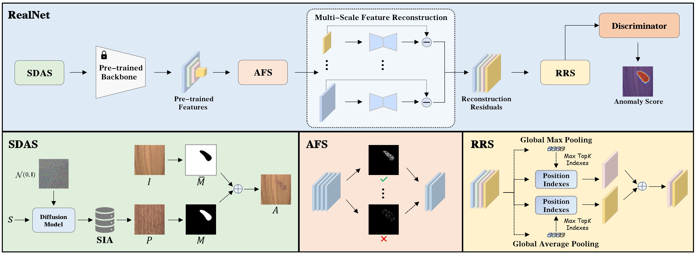
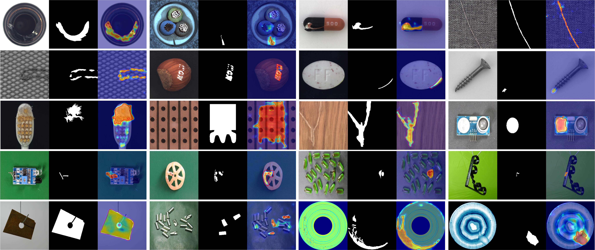

# RealNet

**💡 This is the official implementation of the paper "RealNet: A Feature Selection Network with Realistic Synthetic Anomaly for Anomaly Detection (CVPR 2024)" [[arxiv]](https://arxiv.org/abs/2403.05897)**  
  
  
RealNet is a simple yet effective framework that incorporates three key innovations: First, we propose Strength-controllable Diffusion Anomaly Synthesis (SDAS), a diffusion process-based synthesis strategy capable of generating samples with varying anomaly strengths that mimic the distribution of real anomalous samples. Second, we develop Anomaly-aware Features Selection (AFS), a method for selecting representative and discriminative pre-trained feature subsets to improve anomaly detection performance while controlling computational costs. Third, we introduce Reconstruction Residuals Selection (RRS), a strategy that adaptively selects discriminative residuals for comprehensive identification of anomalous regions across multiple levels of granularity.


<div align=center></div>  


### 🏆 Anomaly synthesis  
We employ the diffusion model for anomaly synthesis, providing `360k` anomaly images for anomaly detection models training across four datasets (MVTec-AD, MPDD, BTAD, and VisA). [[Download]](https://drive.google.com/drive/folders/12B1SMmdsVc6UPDoLP6cctn4YvQfk8cS6?usp=drive_link)
<div align=center></div>  
  

### 🏆 Diffusion model checkpoints  
The diffusion model [[Download]](https://drive.google.com/drive/folders/1kQCuAc0Tlf-XZosJLgKleUYvPJ33zyBK?usp=drive_link) and the guided classifier (optional) [[Download]](https://drive.google.com/drive/folders/1x-TSOXVYSQgvub1de5m8R_FF4m8pD1ow?usp=drive_link) trained on the MVTec-AD, MPDD, BTAD, and VisA datasets.  

### 🏆 Feature reconstruction-based method

|      | Image AUROC     | Pixel AUROC     |
| :----------: | :----------: | :----------: |
| MVTec-AD | 99.6 | 99.0 |
| MPDD | 96.3 | 98.2 |
| BTAD | 96.1 | 97.9 |
| VisA | 97.8 | 98.8 |

## 🔧 Installation

To run experiments, first clone the repository and install `requirements.txt`.

```
$ git clone https://github.com/cnulab/RealNet.git
$ cd RealNet
$ pip install -r requirements.txt
```  
### Data preparation 
Download the following datasets:
- **MVTec-AD [[Official]](https://www.mvtec.com/company/research/datasets/mvtec-ad/) or [[Our Link]](https://drive.google.com/file/d/1jo8kYau8U-Z2OzAgb4wjqnCecKK-6N11/view?usp=drive_link)**  
- **MPDD [[Official]](https://github.com/stepanje/mpdd) or [[Our Link]](https://drive.google.com/file/d/1GVHC2lCt3QUBkVbMCGQ47jwZ3NkQSUgk/view?usp=drive_link)**  
- **BTAD [[Official]](http://avires.dimi.uniud.it/papers/btad/btad.zip) or [[Our Link]](https://drive.google.com/file/d/1_J2b3yEr4VUqRZEL6V0wK8r8hkHaV77c/view?usp=drive_link)**  
- **VisA [[Official]](https://github.com/amazon-science/spot-diff) or [[Our Link]](https://drive.google.com/file/d/1xl46seYQkjC2B3mLxBhfaXSJTydOAfoo/view?usp=drive_link)**  
  
**For the `VisA` dataset, we have conducted format processing to ensure uniformity. We strongly recommend you to download it from our link.**   

If you use `DTD` (optional) dataset for anomaly synthesis, please download:  
  
- **DTD [[Official]](https://www.robots.ox.ac.uk/~vgg/data/dtd/) or [[Our Link]](https://drive.google.com/file/d/1omufc0m67sPmthvralN8K40n8TWl4z8e/view?usp=drive_link)**  
  
Unzip them to the `data`. Please refer to [data/README](data/README.md).  
  
## 🚀 Experiments
### 🌞 Training diffusion model  

We load the diffusion model weights pre-trained on ImageNet, as follows:  

- **Pre-trained Diffusion [[Official]](https://openaipublic.blob.core.windows.net/diffusion/jul-2021/256x256_diffusion.pt) or [[Our Link]](https://drive.google.com/file/d/1OyiUJOWBdrFUumiO5TBn0-APYj5DpblD/view?usp=drive_link)**  
  
We use the guided classifier to improve image quality (optional):

- **Pre-trained Guided Classifier [[Official]](https://openaipublic.blob.core.windows.net/diffusion/jul-2021/256x256_classifier.pt) or [[Our Link]](https://drive.google.com/file/d/1ZdzR3rXPzyzC67kHJmOQL38P9zbBbZja/view?usp=drive_link)**  
  
Download them and place them in the `pretrain` folder.  
  
Train the diffusion model on the MVTec-AD dataset:  
```
$ python -m torch.distributed.launch --nproc_per_node=4  train_diffusion.py --dataset MVTec-AD  
```  
   
Train the guided classifier on the MVTec-AD dataset:  
```
$ python -m torch.distributed.launch --nproc_per_node=2  train_classifier.py --dataset MVTec-AD 
```  
  
We use `4*A40 GPUs` and take 48 hours training the diffusion model, and use `2*RTX3090 GPUs` and take 3 hours training the guided classifier.  
  
We provide the following checkpoints:  
- **MVTec-AD: [[Diffusion]](https://drive.google.com/file/d/1cl2w5eCFrmbOEWlcqPakignI4CHZdm_d/view?usp=drive_link), [[Guided Classifier]](https://drive.google.com/file/d/1-geYTTmeDD9yZzEtstbgjwlWFfgNhld8/view?usp=drive_link)**  
- **MPDD: [[Diffusion]](https://drive.google.com/file/d/1GYUdxObhgu-kWIwBf6gumsMOY3IZDF6o/view?usp=drive_link), [[Guided Classifier]](https://drive.google.com/file/d/1pLEOk4D5o80Yzq7RDeSSBv2HaF76Fxf5/view?usp=drive_link)**  
- **BTAD: [[Diffusion]](https://drive.google.com/file/d/1IYktXaXIOCv3otIVTmvj2Ck5DOeLHXiN/view?usp=drive_link), [[Guided Classifier]](https://drive.google.com/file/d/1ASS70U72VOVcAqaN4AK-EZlgEGqfj1p3/view?usp=drive_link)**  
- **VisA: [[Diffusion]](https://drive.google.com/file/d/1FzgW5xRz-TtPBkbMBbSoAJDq5gkO6Yd_/view?usp=drive_link), [[Guided Classifier]](https://drive.google.com/file/d/15bdOwBdO_bd74p2rcIKt9pTMDzxgjoJW/view?usp=drive_link)**  

Download them to the `experiments`. Please refer to [experiments/README](experiments/README.md).  
### 🌞   Strength-controllable Diffusion Anomaly Synthesis

Sample anomaly images using `1*RTX3090 GPU`:  
```
$ python -m torch.distributed.launch --nproc_per_node=1  sample.py --dataset MVTec-AD
```  
  
We provide `10k` sampled anomaly images with a resolution of `256*256` for each category, which can be downloaded through the following link:   
- **MVTec-AD [[Download]](https://drive.google.com/file/d/1Rs6XRb6v3WdSidiFsMHMK9tALqaSMY3u/view?usp=drive_link)**  
- **MPDD [[Download]](https://drive.google.com/file/d/1SdRNyoaG0FrBp79UrdMT0L15jigZMveW/view?usp=drive_link)**  
- **BTAD [[Download]](https://drive.google.com/file/d/1r4HlORHzgyz9nHr2QTvU2odPZytco-Y2/view?usp=drive_link)**  
- **VisA [[Download]](https://drive.google.com/file/d/1Dq75NOUWIUdt_DV6JiVhwwYAKR7EeVJC/view?usp=drive_link)**  


### 🌞  Training RealNet   
  
Train RealNet using `1*RTX3090 GPU`:  
```
$ python -m torch.distributed.launch --nproc_per_node=1  train_realnet.py --dataset MVTec-AD --class_name bottle
```  
  
[realnet.yaml](experiments/MVTec-AD/realnet.yaml) provides various configurations during the training.  
  
More commands can be found in [run.sh](run.sh).  
### 🌞  Evaluating RealNet  
  
Calculating Image AUROC, Pixel AUROC, and PRO, and generating qualitative results for anomaly localization:
```
$ python  evaluation_realnet.py --dataset MVTec-AD --class_name bottle
```  
<div align=center></div>  

## ✈️ Others  
  
We also provide some generated `normal` images for each category (setting the anomaly strength to 0 in the paper), which can be downloaded through the following link:   
- **MVTec-AD [[Download]](https://drive.google.com/file/d/1e4A4cGJkCYD4KCD0GHutSleaJqHM5fNb/view?usp=drive_link)**  
- **BTAD [[Download]](https://drive.google.com/file/d/1MXRqcY0yfbsOY59ZJ4p4rlmmDo4qS6dK/view?usp=drive_link)**  
- **VisA [[Download]](https://drive.google.com/file/d/10r1moi4LW1DrlujY-1-aVYjVRcFJUSO_/view?usp=drive_link)**  
  
The additional file directory of this repository:  
- **[[Google Drive]](https://drive.google.com/drive/folders/1DwAR6jS7x4PcXP8ygDnd5cEsHP0BsKdU?usp=drive_link)**  
- **[[Baidu Cloud]](https://pan.baidu.com/s/1Aqc1TwTMXTemlR3-TjyuaA?pwd=6789) (pwd 6789)**  
  
Code reference: **[UniAD](https://github.com/zhiyuanyou/UniAD)** and **[BeatGans](https://github.com/openai/guided-diffusion)**.
## 🔗 Citation  

If this work is helpful to you, please cite it as:
```
@inproceedings{zhang2024realnet,
      title={RealNet: A Feature Selection Network with Realistic Synthetic Anomaly for Anomaly Detection}, 
      author={Ximiao Zhang, Min Xu, and Xiuzhuang Zhou},
      year={2024},
      eprint={2403.05897},
      archivePrefix={arXiv},
      primaryClass={cs.CV}
}
```

